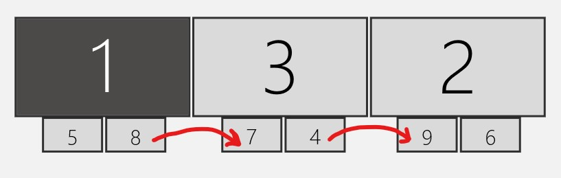

#  Saltarina 
Saltarina is a simple tray-based app that allows your mouse to "hop" across gaps between monitors to the next closest monitor.

Saltarina maps your monitor arrangement, and watches your mouse position. When your mouse "hits" the edge of a screen, it hops over to the next screen. 

## Features
- Easy Installer and Start Menu icon
- System Tray Icon and Interaction 
- Optional Autostart
- Windows 10